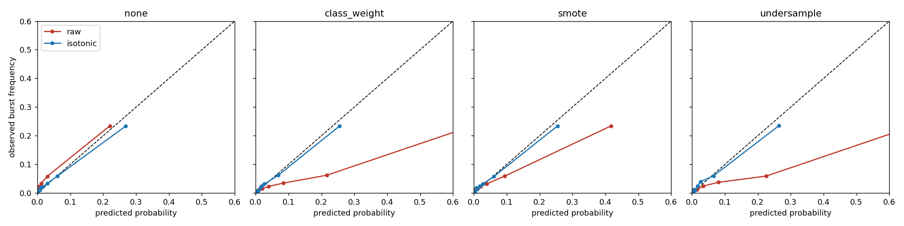
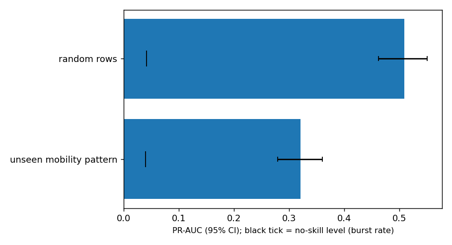
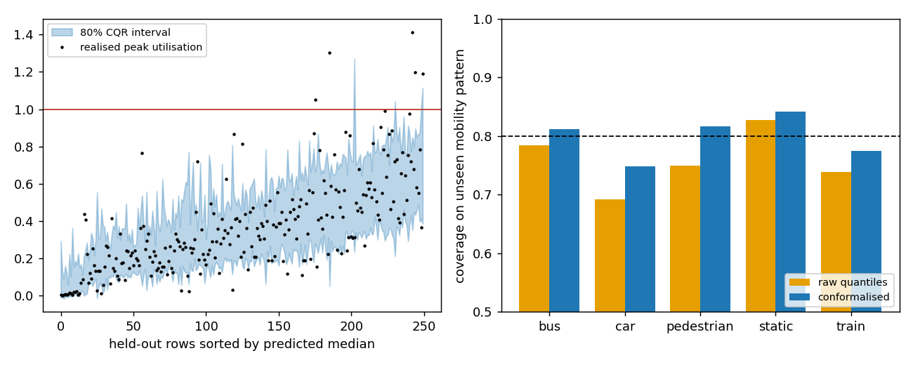
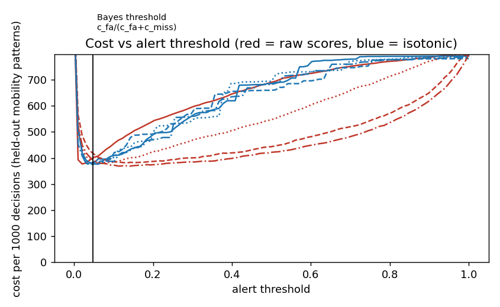

# tailwatch

Forecasting rare congestion events in a cellular network the way weather is forecast: as a probability ("4% chance the channel collapses within 10 s") plus a prediction interval for the coming peak, tested on real data only.



## What I did
- Ran one pipeline on **two real data sets**:
  - **msData**, an Open RAN 5G testbed with 3.2 million per-user records. I summed the downlink rate of all users per second to get cell load, and defined a burst as the load reaching 10 Mbit/s within 10 s.
  - **Client-side 5G traces** from an Irish operator: 87 sessions, 55.6 hours of 1 Hz phone measurements. The event is the channel quality (CQI) collapsing to 5 or less within 10 s.
- Held out whole groups (mobility patterns in msData, mobility and app pairs in the 5G traces), so every test is on something the model never saw.
- Compared ways of handling the rare class (none, class weights, SMOTE, under-sampling), recalibrated the probabilities, built a cost-based alert policy, and added conformal prediction intervals.
- Compared feature-selection methods and measured how bursty the msData load is (Hurst exponent 0.88).
- **v2:** compared more regularised and randomised learners (ExtraTrees, random forest, CatBoost) and 26 extra burst-history features, with hyper-parameters chosen by nested validation inside the training groups.

## Results

| finding | msData | 5G traces |
|---|---|---|
| Event rate | 4.0% | 3.8% |
| PR-AUC on unseen groups: none / class weights / SMOTE / under-sampling | 0.32 / 0.33 / 0.33 / 0.35 | 0.13 / 0.12 / 0.13 / 0.15 |
| Calibration error (ECE) raw to isotonic | 0.065 to 0.006 | 0.091 to 0.012 |
| Alert cost per 1000 decisions, raw to calibrated | 416 to 376 | 643 to 512 |
| PR-AUC on random rows vs an unseen group | 0.51 vs 0.32 | 0.27 vs 0.11 |
| 80% interval coverage overall / when the event happens | 0.78 / 0.25 | 0.81 / 0.09 |

**v2.** PR-AUC on unseen groups, repo model vs ExtraTrees (95% interval of the difference in brackets):

| | msData | 5G traces |
|---|---|---|
| boosted trees with class weights (v1) | 0.334 | 0.121 |
| ExtraTrees, nested validation (v2) | **0.385** (+0.051, +0.028 to +0.067) | **0.141** (+0.020, +0.010 to +0.030) |

On msData ExtraTrees is better in all five held-out mobility patterns. The extra burst-history features did not transfer to unseen groups (boosted trees 0.334 to 0.243), so the v2 model uses the original 36 features. Details: [docs/V2.md](docs/V2.md).







Tables: [msData](results/msdata/summary.md), [5G traces](results/fiveg/summary.md), [side by side](results/comparison.md).

## How it was built

```
download -> cell-level load -> streams -> features (backward windows) and labels (forward window)
         -> leave-one-group-out models -> calibration, policy, intervals -> report
```

All settings are in `configs/default.yaml`. 16 tests. Design notes are in `docs/BLUEPRINT.md`.

## Tech stack
Python, Polars, NumPy, SciPy, scikit-learn, imbalanced-learn, CatBoost, matplotlib, pytest.

## Data
msData: B. Xavier et al., *Performance measurement dataset for open RAN with user mobility and security threats*, Computer Networks, 2024, and S. Khanal et al., *msData*, [arXiv:2603.16497](https://arxiv.org/abs/2603.16497).
5G traces: D. Raca et al., *Beyond Throughput, the Next Generation: a 5G Dataset with Channel and Context Metrics*, MMSys 2020.
