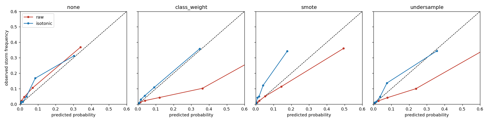
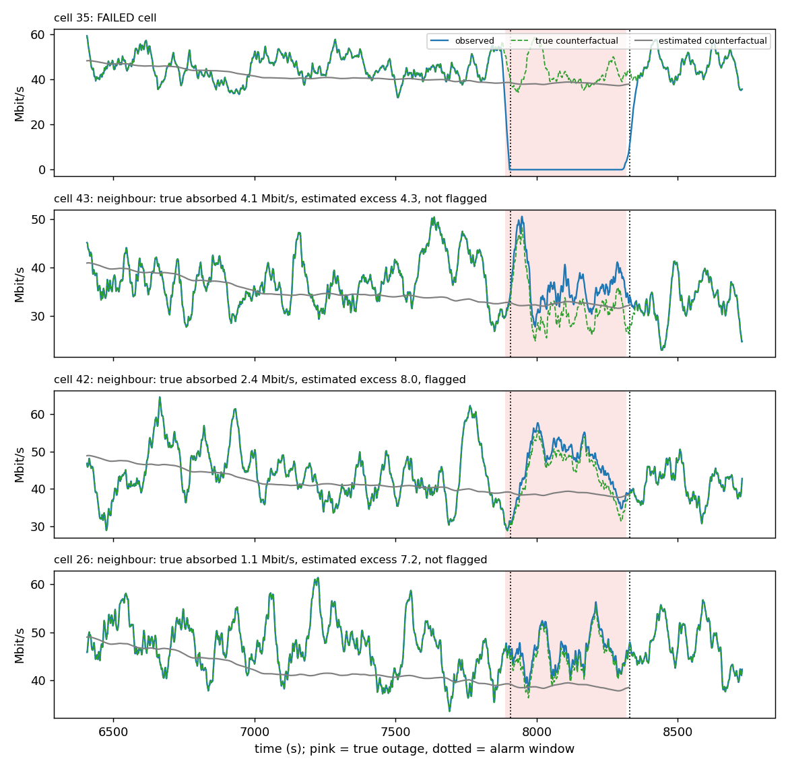

# tailwatch: storm radar for the radio network

Congestion in a cellular network is rare, bursty and local. `tailwatch` treats it like severe weather: instead of a
yes/no label it issues a **calibrated probability** ("12% chance this cell reaches a high-load burst within 10 s") and a
**prediction interval** for the coming peak, then asks the questions a meteorologist would. When it says 30%, is it right
30% of the time? Does that still hold in an environment it has never seen? What does an alert policy built on it cost?



It runs on two data sets with the same code:

* a **synthetic city digital twin** (hex-grid cells, four districts, scripted surges, heavy-tailed ON/OFF sources): a
  controlled benchmark where whole districts can be held out;
* a **real 5G trace**, [msData](https://huggingface.co/datasets/subinak/Open_RAN_Performance_Measurement_Dataset_with_Traffic_and_Mobility_Labels)
  (Open RAN testbed, 3.2 M records), where whole **mobility patterns** (car, bus, train, static, pedestrian) are held out.

The twin also runs **cell-outage scenarios with exact ground truth** to ask how well monitoring data can recover who was affected
(see [Cell outages](#cell-outages-how-many-users-did-a-failed-cell-really-affect)).

The headline: **the twin's main findings replicate on the real trace**, one does not, and the twin turns out to be
less bursty than reality in a specific, measurable way. Full side-by-side table: [`results/comparison.md`](results/comparison.md).

## What replicates (twin vs real trace)

All figures are out-of-group: every test row is predicted by a model that never saw that row's district / mobility
pattern. Intervals are 95% block-bootstrap CIs. The two systems differ, so compare patterns, not absolute levels.

| finding | digital twin | real trace |
|---|---|---|
| Rare-event rate | 5.7% | 4.0% |
| **No imbalance strategy is a clear winner** (PR-AUC: none / class weights / SMOTE / under-sampling) | 0.49 / 0.51 / 0.45 / 0.52, CIs overlap | 0.32 / 0.33 / 0.33 / 0.35, CIs overlap |
| **Class weights make the model over-predict**, recalibration repairs it (ECE raw -> isotonic) | 0.077 -> 0.007 | 0.065 -> 0.006 |
| Calibrated probabilities need no threshold tuning (cost per 1000 decisions at the textbook threshold, raw -> calibrated; tuned threshold) | 359 -> 330; 329 | 416 -> 376; 376 |
| **A random split flatters the model** (PR-AUC random rows vs unseen group) | 0.57 vs 0.44 (+30%) | 0.51 vs 0.32 (+59%) |
| **Intervals look fine on average but miss the tail**: 80% conformal coverage overall / when the event occurs | 0.80 / 0.38 | 0.78 / 0.25 |
| Small feature subsets match all features? | **yes** (6 features: PR-AUC 0.50 to 0.54 vs 0.51 with all 31) | **no** (6 features: 0.285 to 0.300 vs 0.334 with all 36) |

Tables with CIs for every cell: [`results/summary.md`](results/summary.md) (twin) and
[`results/real/summary.md`](results/real/summary.md) (real). The feature-selection row is where the twin misleads: its signal
sits in a few utilisation features, the real trace needs the wider channel and buffer context.

## Is the twin shaped like reality? (not quite)

Same estimator and series length for all rows (412 s chunks; real streams of at least 300 s), median [IQR]:

| series | Hurst H | CV (std/mean) | autocorrelation at 1 s |
|---|---|---|---|
| real trace (119 streams) | 0.88 [0.83, 0.93] | 0.95 [0.77, 1.16] | 0.53 [0.42, 0.60] |
| twin as published (45 to 70 sources per cell) | 0.74 [0.67, 0.80] | 0.32 [0.27, 0.37] | 0.76 [0.73, 0.79] |
| twin with 4 sources per cell (testbed-sized) | 0.72 [0.63, 0.80] | 1.14 [0.94, 1.38] | 0.75 [0.71, 0.80] |

Both are clearly self-similar (iid noise gives H about 0.53). The twin's low variability is explained by averaging many
sources: with a testbed-sized source count its CV matches the real trace. Its **temporal shape does not match**: real load
is more long-range dependent (H 0.88 vs 0.72) but fluctuates faster second to second (autocorrelation 0.53 vs 0.75).
Fitting the generator to this (e.g. a mix of timescales) is the obvious next step; it is not done here.

## Twin results at a glance

| question | finding |
|---|---|
| Rare class | Storm = congestion onset within 30 s. 5.7% of decision points overall, 1.3% to 13.5% by district. |
| Imbalance handling | PR-AUC none 0.49 [0.44, 0.55], class weights 0.51 [0.45, 0.56], under-sampling 0.52 [0.46, 0.57], SMOTE 0.45 [0.40, 0.50]. SMOTE lowest, the rest overlap. |
| Calibration | Class weights and under-sampling over-predict (mean p 0.133 and 0.103 vs true rate 0.057). Recalibrating on later data: ECE 0.077 -> 0.007, Brier 0.064 -> 0.040. |
| Does calibration pay? | With costs 20 per missed storm and 1 per false alarm a calibrated model can use the textbook threshold 1/21 untuned (330 per 1000 decisions) while the raw class-weighted model costs 359 there. A validation-tuned threshold reaches about 330 for every strategy except SMOTE (about 410). Calibration buys *not having to tune*, not a lower floor. |
| Generalisation | PR-AUC 0.57 [0.52, 0.62] on random rows vs 0.44 [0.39, 0.49] on an unseen district; per district 0.12 (residential, 1.3% storms) to 0.62 (leisure, 13.5%). |
| Intervals | Conformalised quantile regression: 79.7% pooled coverage for an 80% target, 71% to 87% across districts, **38% on rows that became storms**. |
| Feature selection | 3 features match all 31. Selection cost: mutual information 5.0 s, tree 1.2 s, L1 1.1 s, PCA 0.05 s. L1 picks unstable features across folds (Jaccard 0.43 to 0.62). |
| Scale | Same job on Parquet at 1x/10x/100x (172 k to 17.3 M rows): Polars 0.68 s, DuckDB 4.4 s, pandas 11.3 s at 100x, identical outputs. 11.3 bytes/row, 3.8x smaller than CSV. |

`results/radar.html` is a self-contained animated hex-map radar of a surge on the twin (colour = forecast probability,
white ring = congestion really began within the horizon). Every forecast shown is from a model that never saw that cell's district.

## Cell outages: how many users did a failed cell really affect?

The twin can also take cells down. `tailwatch outage` removes one cell (or two adjacent cells, a site fault) for 5 to 20
minutes. Every affected user is either **lost** for the whole outage or **reconnects to a neighbouring cell** after a delay,
chosen by fixed reselection weights the estimator never sees; they return to the repaired cell a little late. Because the world
is regenerated from seeds, the counterfactual load of every cell is known exactly, so lost, rerouted and degraded traffic can be scored
against exact ground truth (conservation of traffic is a unit test).

The estimator sees only monitoring data: per-second cell load and active users, capacities, the topology, the failed cells and an
alarm window that starts and ends late, plus optionally noisy handover statistics. Counterfactual load comes from a robust
pre-period level scaled by an index of far-away control cells. A neighbour counts as an absorber when its excess load beats a
**placebo-in-space** null built from the control cells over the same window. 4 simulated cities x 40 scenarios; world 0 chose the method, and
**every number below is from the other 3 worlds (120 scenarios**: 79 single-cell, 30 two-cell, 11 where nobody can reconnect; 40 overlap a demand
surge). Full tables: [`results/outage/summary.md`](results/outage/summary.md).



| question | result (95% CI over scenarios) |
|---|---|
| How much traffic did the failed cells displace? | within a median **9%** of truth |
| Which neighbours absorbed traffic? | data only: precision **0.83** [0.77, 0.89], recall 0.43 [0.37, 0.50]. Flagging by handover statistics alone has F1 0.79 but raises a false alarm in 100% of the outages where nobody reconnects (data only: 18%) |
| How much traffic must a neighbour absorb to be found? | **6+ Mbit/s: 64%**, 3 to 6: 30%, 1 to 3: 14%, under 1: 7% |
| Who took how much? (distance to true shares, 0 is perfect) | uniform 0.38, data only 0.28, data + handover statistics with moderate noise 0.19 to 0.20; statistics with noise sigma 2 and full weight are worse than data alone (0.42) |
| Degraded performance in the neighbours | estimate correlates with truth at **r = 0.83** [0.61, 0.92] |
| How much traffic was lost vs reconnected? | **cannot be pinned down**: loss-fraction error 22.5 pp [18.9, 25.9] from load alone, 20.3 pp with good handover statistics, even 19.2 pp when handed the true shares; always guessing 50% gives 19.7 pp [17.4, 22.0] |
| Is the absorber test honest? | false-positive rate on control cells 0.059 [0.057, 0.061] against a nominal 0.05 |

What this says about monitoring (all from the tables above, in a simulator, so treat as hypotheses to test on real outages):

* **Per-second load cannot tell how many users were lost.** The neighbours' own bursts, not the baseline window, set the noise floor (baseline
  windows of 300 to 3000 s give similar errors, 22 to 27 pp, on the development world), and longer outages did not help (21, 25, 21 pp for short, medium and long).
  Direct counters, such as attach failures or reselection counts for the failed cell, would measure what load can only guess.
* **Handover statistics are worth keeping when they are accurate.** They clearly improve the split of rerouted traffic for noise up to about sigma 1 (the traffic estimate moves in the same direction but within the intervals),
  and hurt when they are very noisy and trusted fully, so validate them before leaning on them.
* **Small absorbers are invisible at one-second load**: neighbours taking under 3 Mbit/s were found 14% of the time or less, yet several of them can still degrade.
* **Surges confuse the estimate**: error was 28.9 pp when the outage overlapped a scripted surge against 19.3 pp otherwise, so an event calendar
  belongs in the monitoring pipeline.

## How the real trace is used (and what it is not)

msData has per-UE MAC/PHY records from one cell with up to four UEs, a mobility pattern and a traffic label per record.
It has **no per-cell load column and no capacity**, so `tailwatch` builds a cell-level load by summing the downlink rate of all
UEs in a 1 s bin, splits the timeline into 702 contiguous streams (44.6 h of cell time), and defines a **high-load burst**: the
load reaches 10 Mbit/s (about the 99.3rd percentile) within 10 s. That level is a configured labelling convention, **not verified
congestion**. Features are trailing-window load statistics plus CQI, MCS, buffer and SINR; labels look strictly forward. The traffic
label (which includes DoS and DDoS classes) is never a model input, only used in a descriptive table (burst rate by the heaviest
UE's traffic: dos-hulk 9.9%, web browsing 7.3%, YouTube 5.9%, IoT 1.0%).

## Why these choices

* **Digital twin validated against its own theory.** Pareto ON/OFF aggregation (shape 1 < a < 2) gives long-range-dependent
  traffic with H = (3 - a_min)/2. Measured H is 0.73 to 0.82 vs theoretical 0.80 to 0.90 (the estimator reads low on 4 h).
* **Onset, not persistence.** Rows already above the level are dropped; the task is forecasting the transition.
* **Held-out groups differ on purpose** (different source counts, rates, tail indices; different mobility), so the
  generalisation test is a real distribution shift.
* **Leakage guards.** Labels strictly forward, features strictly backward; unit tests compare both with a naive
  implementation. Twin validation is separated from training by a purge gap; on the real trace validation uses every 4th stream
  (patterns were recorded in time blocks, so time validation would confound pattern and date).
* **Alert policy built on probabilities**, with costs read from config, so the operator's trade-off is an input.

## Run it

```bash
pip install -e ".[dev]"      # add ".[duckdb]" to include DuckDB in the scale benchmark
tailwatch all                # twin: simulate -> hurst -> experiments -> bench -> radar -> report (about 15 min)
tailwatch real               # real trace: download (758 MB) -> prepare -> compare burstiness -> experiments -> report -> comparison (about 6 min)
tailwatch outage               # cell-outage impact study on the twin (about 1 min)
pytest                       # 36 tests, no network needed
```

Steps run alone too: `simulate | hurst | experiments | bench | radar | report` and `real-download | real-prepare | real-validate |
real-experiments | real-report | compare`. Every parameter is in [`configs/default.yaml`](configs/default.yaml) and type-checked at
load (`--config other.yaml` to override). Artefacts go to `data/` (git-ignored) and `results/`, `results/real/`.

## Layout

```
configs/default.yaml   all tunables: city, events, thresholds, models, costs, benchmark, real-trace settings
src/tailwatch/
  config.py            typed, validated config; no code-side defaults
  sim.py hurst.py      digital twin and its self-similarity check          features.py   twin features and labels
  real.py              msData download, cell-level aggregation, streams, features, twin-vs-real burstiness
  core.py              folds, resampling, calibrators, metrics, block bootstrap (shared by both data sets)
  experiments.py generalization.py probabilistic.py selection.py   the studies (shared)
  outage_sim.py        outage scenarios with ground truth      outage_est.py   estimator (counterfactual, placebo test, GLS)
  outage_eval.py       scoring, bootstrap CIs, figures, summary
  scale.py             Parquet engine benchmark       radar.py   twin radar
  plots.py report.py compare.py cli.py store.py
tests/                 leakage, determinism, conformal coverage, calibration, config; real-trace aggregation and folds
docs/BLUEPRINT.md      design decisions (ADRs) and failure handling
```

## What is not measured

* **Real operator networks.** The real trace is one testbed cell with at most 4 UEs and scripted traffic (benign and attack
  classes). Nothing here says how a live multi-cell network behaves. The twin is synthetic and its results describe the generator.
* **Geography on real data.** One cell has no spatial layout, so the real-trace test is generalisation across *mobility
  patterns*, not across places. The geographic-generalisation result comes from the twin only.
* **Congestion on real data.** Capacity is unobserved; "high-load burst" is a configured level. A different level changes the
  rates (a 6 Mbit/s level gave 20% bursts and was rejected as not rare; the choice of 10 Mbit/s was made on label rates, not on model performance).
* **Time resolution.** msData is called millisecond-resolution but records arrive about every 97 ms (median; 44 to 295 ms 5th to 95th percentile)
  and each aggregates 90 TTIs. Statements are at 1 s. The timestamp unit (10 microsecond ticks) is inferred from the epoch
  magnitude, not documented.
* **Silence read as no traffic.** A UE without a record in a bin is assumed idle. Short silences inside a stream are filled with zero load.
* **Small real groups.** The train pattern has 35 streams and 132 burst onsets; per-pattern numbers are indicative. Mobility patterns were recorded in blocks
  of time, so pattern and recording day are confounded; the stream-based validation split does not remove that.
* **Pooled vs per-group metrics.** Pooled PR-AUC mixes groups with different rates and depends on per-group calibration maps; per-group values are in the summaries.
* **Outages on real data.** The real trace is a single cell, so it cannot test outage impact. The outage study is simulated: the user reselection rule, the
  handover-statistics noise, the delays and the surge overlap are my assumptions, and the simulator's average loss (50%) favours the "always guess 50%" baseline. Estimates were
  chosen on world 0 and scored on 3 other worlds (120 scenarios) that share the same city design; no real outage data was used.
* **Why outage estimates are noisy.** The flat error across outage lengths is consistent with long-range dependence in the traffic (the Hurst result above), but that link was not tested.
* **Radio effects.** In the twin signal strength is a function of load plus noise; no propagation, handover or inter-cell interference.
* **Causal claims** about features. Importances describe predictive use.
* **Coverage guarantees.** Conformal coverage assumes exchangeability; held-out groups violate it, which the per-group coverage spread and the weak tail coverage show.
* **Single seed** for the twin and models; CIs reflect resampling of one realisation (blocks of 600 s per cell on the twin, 60 s on the real trace), not re-simulation.
* **Scale test** replicates cells with new ids; it measures engine throughput on one machine, not modelling behaviour at scale.

## Data attribution and licences

Code: MIT (see `LICENSE`). The msData file is **not redistributed**; `tailwatch real-download` fetches it from Hugging Face and
verifies its byte count. The dataset card states MIT, the msData paper states CC BY 4.0; both permit reuse with attribution, which is given here. Please cite:

* B. Xavier, M. Dzaferagic, M. Martinello, M. Ruffini, *Performance measurement dataset for open RAN with user mobility and security threats*, Computer Networks, 2024 ([doi link](https://www.sciencedirect.com/science/article/pii/S1389128624005425)).
* S. Khanal, S. Tirupathi, M. Dzaferagic, M. Ruffini, T. B. Pedersen, *msData: A Millisecond-Resolution Network Dataset for Advancing Time Series Foundation Models* ([arXiv:2603.16497](https://arxiv.org/abs/2603.16497)).
