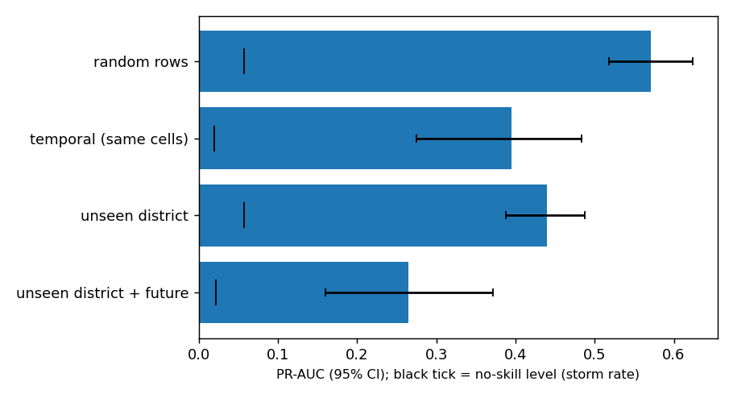
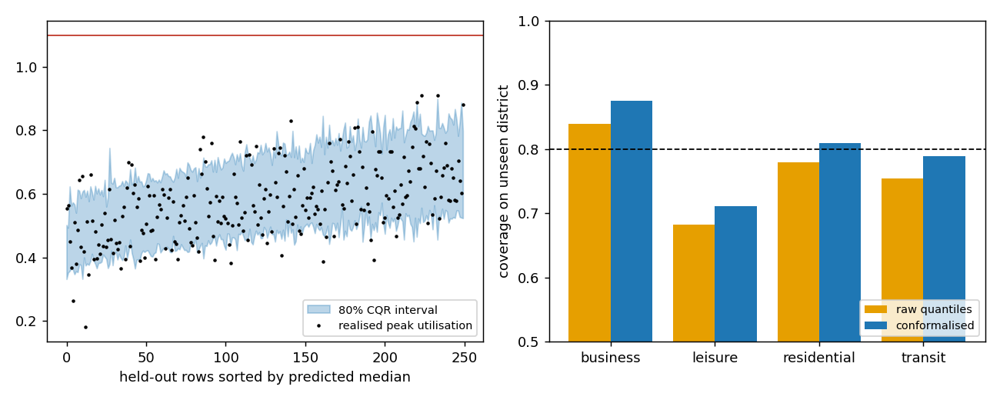
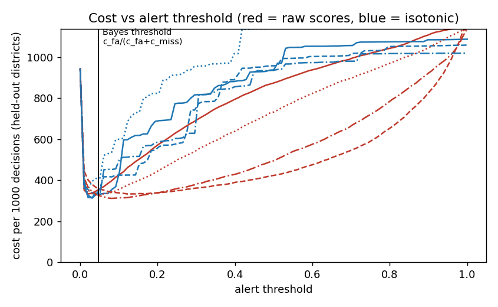

# tailwatch

Forecasting congestion bursts in a cellular network the way weather is forecast: as a probability ("12% chance this cell reaches a high-load burst in the next 10 s") plus a prediction interval for the coming peak.


## What I did
- Built a **digital twin of a city network**: hex-grid cells, four districts, scripted surges and heavy-tailed ON/OFF traffic sources.
- Ran the same code on a **real 5G trace** (msData, an Open RAN testbed with 3.2 million records). I summed the downlink rate of all users per second to get cell load, and defined a high-load burst as the load reaching 10 Mbit/s within 10 s.
- Held out whole districts (twin) and whole mobility patterns (real trace: car, bus, train, static, pedestrian) so every test is on something the model never saw.
- Compared ways of handling the rare class (none, class weights, SMOTE, under-sampling), recalibrated the probabilities, built cost-based alert policies, and added conformal prediction intervals.
- Compared feature-selection methods and benchmarked pandas, Polars and DuckDB on Parquet files at 1x, 10x and 100x size.
- Measured how bursty the twin is (Hurst exponent) against the real trace.
- Simulated **cell outages** with exact ground truth and built an estimator of how much traffic was displaced, which neighbours absorbed it, and how much was lost.
- Made an animated radar map of a surge (`results/radar.html`).

## Results

| finding | digital twin | real trace |
|---|---|---|
| Burst rate | 5.7% | 4.0% |
| PR-AUC: none / class weights / SMOTE / under-sampling | 0.49 / 0.51 / 0.45 / 0.52 | 0.32 / 0.33 / 0.33 / 0.35 |
| Calibration error (ECE) raw -> isotonic | 0.077 -> 0.007 | 0.065 -> 0.006 |
| PR-AUC on random rows vs unseen group | 0.57 vs 0.44 | 0.51 vs 0.32 |
| 80% interval coverage overall / when the event happens | 0.80 / 0.38 | 0.78 / 0.25 |
| 6 features vs all features (PR-AUC) | 0.50 to 0.54 vs 0.51 | 0.285 to 0.300 vs 0.334 |

Twin vs real traffic shape (median):

| series | Hurst H | CV | autocorrelation at 1 s |
|---|---|---|---|
| real trace (119 streams) | 0.88 | 0.95 | 0.53 |
| twin (45 to 70 sources per cell) | 0.74 | 0.32 | 0.76 |
| twin (4 sources per cell) | 0.72 | 1.14 | 0.75 |

Other twin results: the same job on Parquet at 100x (17.3 million rows) took 0.68 s with Polars, 4.4 s with DuckDB and 11.3 s with pandas.

**Cell outages** (120 scenarios in 3 simulated cities):
- Displaced traffic was estimated within a median 9% of the truth.
- Absorbing neighbours were found with precision 0.83 and recall 0.43. Neighbours taking 6+ Mbit/s were found 64% of the time.
- The estimate of degraded performance in neighbours correlates with the truth at r = 0.83.








Tables: [twin](results/summary.md), [real](results/real/summary.md), [outage](results/outage/summary.md), [comparison](results/comparison.md).

## How it was built

```
twin:  simulate -> hurst check -> features/labels -> experiments -> benchmark -> radar -> report
real:  download msData -> cell-level load -> streams -> experiments -> report -> compare with twin
outage: simulate outages -> estimate counterfactual load -> placebo test -> score against truth
```

All settings are in `configs/default.yaml`. 36 tests. Design notes are in `docs/BLUEPRINT.md`.

## Tech stack
Python, pandas, Polars, DuckDB, Parquet, NumPy, SciPy, scikit-learn, imbalanced-learn, matplotlib, pytest.

## Data
msData: B. Xavier et al., *Performance measurement dataset for open RAN with user mobility and security threats*, Computer Networks, 2024, and S. Khanal et al., *msData*, [arXiv:2603.16497](https://arxiv.org/abs/2603.16497).
