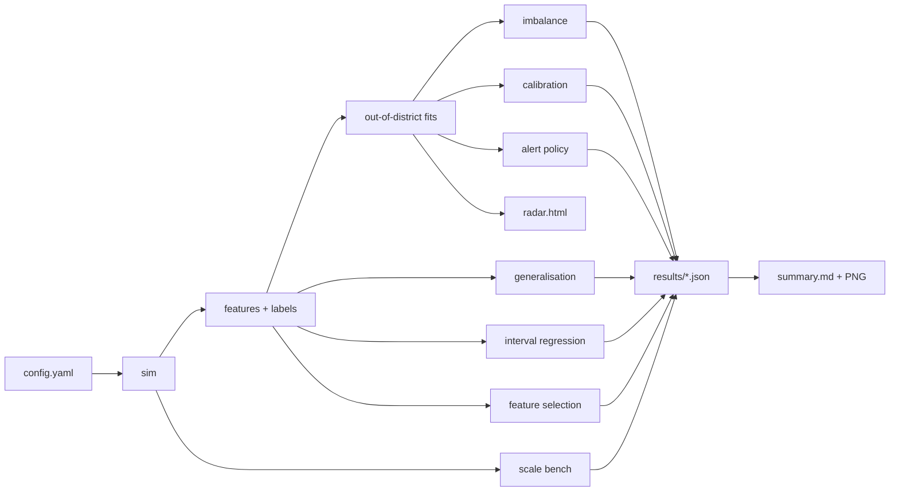

# tailwatch blueprint (condensed)

Written against the `project-blueprint` rules. Sections that do not apply to an offline research pipeline (auth, APIs,
frontend state, queues, deployment topology) are collapsed to one line each below.

## 1. Scope and boundaries
**Does:** simulate a cellular network, build forward-looking congestion labels, compare imbalance handling, produce
calibrated probabilities and conformal intervals, test generalisation to unseen districts, cost an alert policy,
benchmark Parquet processing, render a static radar.
**Does not:** ingest live telemetry, serve predictions, model radio propagation, claim results on real networks.
**Inputs:** `configs/default.yaml` only. **Outputs:** Parquet in `data/`, JSON/PNG/Markdown/HTML in `results/`.

## 2. Architecture
Linear, file-handoff pipeline; every step reads its inputs from disk, so any step can be re-run alone.

## 3. Decisions (ADRs)
| # | Decision | Alternatives | Why |
|---|---|---|---|
| 1 | Synthetic digital twin as the controlled benchmark | Real data only | Reproducible, no licence risk, lets whole districts be held out and has many cells. Cost: results are about the generator, hence ADR 11 to 14. |
| 11 | msData (Open RAN 5G testbed) as the real-data check | Lumos5G, Beyond Throughput (licence not clear), Telecom Italia (10 min resolution), COOPER (synthetic) | The only open set found with sub-second RAN records and a permissive licence (MIT on the dataset card, CC BY 4.0 in the paper; attribution given). Limits: one cell, at most 4 UEs, testbed traffic including attack classes. Downloaded by a verified script, never committed. |
| 12 | Cell load = sum of all UEs' downlink rate per 1 s bin, streams split on silences over 3 s | Per-UE series; per-record 100 ms bins | The question is about the cell, not a UE; per-record spacing is irregular (median 97 ms), so a regular 1 s grid is needed for windows. A UE with no record in a bin is read as no traffic (assumption, stated). |
| 13 | "High-load burst" at a configured 10 Mbit/s, not "congestion" | Percentile of the data; estimated capacity from MCS | The cell's capacity is not observed. A fixed, documented level keeps the label independent of any held-out group; the README never calls it verified congestion. |
| 14 | Mobility pattern is the held-out group; validation = every 4th stream; traffic label is never a model input | Hold out traffic class; time-based validation | One cell has no geography, mobility is the available environment axis. Patterns were recorded in time blocks, so time validation would confound pattern and date. A deployed forecaster would not know the traffic label. |
| 2 | Heavy-tailed ON/OFF sources | Poisson, MMPP, fractional Gaussian noise | Known mechanism for self-similar traffic, with a theory value to validate against. |
| 3 | Leave-one-district-out + temporal purge | Random split, k-fold | Random rows leak through autocorrelation; geography is the generalisation axis the project is about. |
| 4 | HistGradientBoosting | LightGBM, XGBoost, deep nets | Already in scikit-learn, no extra native dependency, fast enough; tabular features. |
| 5 | Calibrate on later data of training districts | Calibrate in-fold, cross-validated calibration | Matches deployment (calibrate on history); shift to a new district is then measured, not hidden. |
| 6 | CQR split conformal | Gaussian intervals, quantile only | Distribution-free finite-sample coverage under exchangeability; tail behaviour reported separately. |
| 7 | Polars primary, pandas and DuckDB as comparators | Spark, Dask | Data fits on one machine at 100x; engines compared on identical output. |
| 8 | Block bootstrap CIs | iid bootstrap, none | Rows within a cell and 10 min are strongly dependent; iid CIs would be too narrow. |
| 9 | Config as typed dataclasses, no code defaults | pydantic, dict | Single source of truth, validated at load, no extra dependency. |
| 10 | Report generated from JSON | Hand-written tables | No number can drift from the experiment that produced it. |

## 4. Configuration (what is configurable and how)
Source: YAML (`--config` or `$TAILWATCH_CONFIG`). Loaded by `config.load_config`, type-checked recursively, then
semantic checks in `validate` (district coverage, Pareto shapes > 1, events inside the horizon, unknown strategies).
Changing any value needs no code change or redeploy. No secrets exist. Only true constants are in code (the four strategy
names, the three calibration variants).

## 5. Failure handling
| Situation | Behaviour |
|---|---|
| Invalid/missing config key | `ConfigError` naming the path; nothing runs |
| Missing upstream artefact | `FileNotFoundError` naming the step to run first |
| Benchmark engine missing, crashes or times out | recorded as `failed: ...` / `timeout` in `bench.json`, remaining scales skipped, other engines continue |
| Engines disagree | `agreement` flag in `bench.json` and the report |
| Class with no positives in a bootstrap block | that replicate is dropped (NaN-safe), not silently zero |
| Re-run | deterministic: per-cell RNG streams seeded from `seed` and cell id; models seeded |

## 6. Testing
`tests/test_core.py`: determinism and cell-independence of the simulator, utilisation = load/capacity, hex adjacency
symmetry, forward labels and backward features against a naive implementation, no nulls, fold isolation (no district or
future leak), conformal coverage on a deliberately wrong interval, Hurst estimator on iid vs persistent series,
calibrators repair an over-confident score, F1 threshold, config rejection.
Experiment outputs are not asserted against fixed numbers: they are results, not specifications.

## 7. Risks
| Risk | Consequence | Mitigation |
|---|---|---|
| Generator quirks drive conclusions | Findings do not transfer | Hurst check; "not measured" section; real-data loader as next step |
| Few cells per district | Wide per-district uncertainty | Block bootstrap; per-district numbers marked indicative |
| Pooled metrics hide heterogeneity | Misleading headline | Per-district table in the report |
| Single seed | CIs understate variance | Stated; multi-seed re-simulation listed as future work |

## 8. Definition of done
Tests pass; `tailwatch all` reproduces every table and figure from the config; no number in the README or
`summary.md` is typed by hand; limitations are listed; nothing presented as real data is synthetic.
